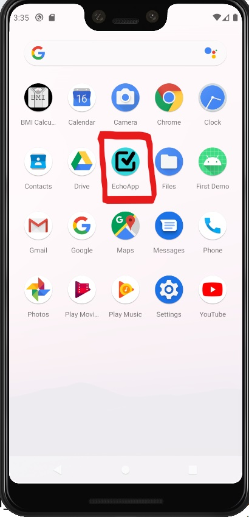
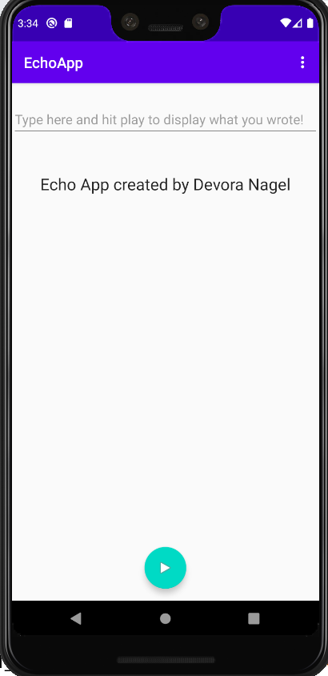
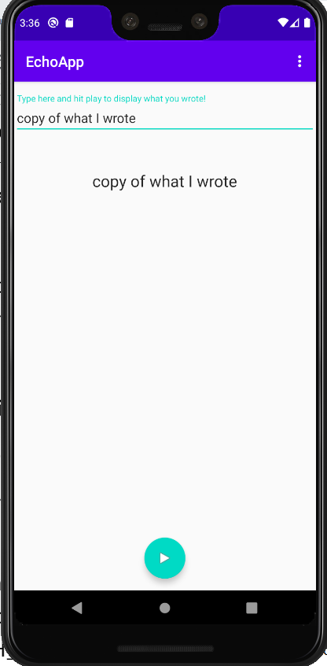

# EchoApp
* Using Android Studio, I created an app that takes user input and copies it into the TextView below.  
* I used a TextInputLayout to display the instruction and receive the user input.  
* The TextView changes to display the user input once the Floating Action Button is clicked.

*This project was created for my Android Application Development Course.*    

Picture of the icon launcher:  
  

Picture at the start of the application:  
  

Picture after pressing the play button:  

